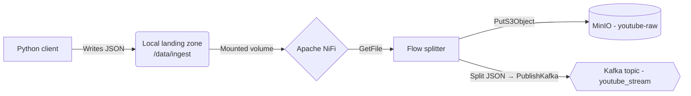

# data-engineering-youtube-pipeline

An end-to-end data engineering pipeline implementing the Lambda Architecture. The project demonstrates ingestion, batch processing, streaming simulation, and visualization using a modern data stack (Spark, Kafka, NiFi, MinIO, Docker).

## Table of Contents
- [Architecture](#architecture)
- [Features](#features)
- [Phase I: Data Source & Extraction](#-phase-i-data-source--extraction-completed)
- [Phase II: Infrastructure & Ingestion](#-phase-ii-infrastructure--ingestion-completed)
- [Project Structure](#project-structure)
- [Prerequisites](#prerequisites)
- [Setup](#setup)
- [Environment variables](#environment-variables)
- [Run the ingestion client](#run-the-ingestion-client)
- [Contributing](#contributing)
- [License](#license)

---

## Architecture

This repository follows the Lambda Architecture to balance low-latency stream processing and accurate historical batch processing:

- Ingestion Layer: Collects data from external APIs (e.g. YouTube Data API v3).
- Storage / Data Lake: Raw data persisted to an S3-compatible store (MinIO) for later batch processing.
- Speed Layer: Simulated streaming via high-frequency polling and Kafka for near-real-time processing.
- Batch Layer: Apache Spark jobs for historical/large-scale transformations.
- Serving Layer: Processed results are stored in a serving database (Postgres) and visualized via BI tools.

---

## Features

- YouTube ingestion client with robust error handling
- Support for batch processing (Spark) and simulated streaming (polling + Kafka)
- Modular code layout for ingestion, processing, and visualization
 
---

## 📍 Phase I: Data Source & Extraction (Completed)

Phase I focused on establishing secure, maintainable connectivity to external data sources and building a reliable extraction client. The goal was a small, well-tested set of extraction components that can be run locally or inside containers and that adhere to security best practices.

### 🔹 Key features

- Source: YouTube Data API v3 for video metadata and statistics.
- Security: API keys are read from environment variables (see the `.env` instructions below) and are excluded from version control.
- Client: A modular Python client (YouTubeClient) performs authenticated API calls with error handling and retry logic.
- Data entities captured: video metadata (title, id, channel) and statistics (view count, like count).

### ⚠️ Technical note on streaming

The YouTube Data API is REST-based and does not provide push-style streaming (WebSockets). To enable a streaming-like workflow we simulate a speed layer using high-frequency polling combined with NiFi and Kafka.

Solution: A scheduled extraction (Python) writes time-stamped JSON snapshots to a local landing directory. NiFi picks up new files, then routes and transforms them into both batch and streaming paths (see Phase II below).

Implementation: Python extraction scripts and NiFi processors that detect new files handle data freshness; the approach is intentionally simple and easy to debug.

### 🚀 Quick start (Phase I)

Follow Setup and Environment sections above for a full environment. Quick checklist to test extraction locally:

1. Ensure you have a working virtual environment and dependencies installed (see "Setup").
2. Create `.env` with your `YOUTUBE_API_KEY` or export the env var directly.
3. Run the ingestion client to fetch a sample and write to the landing zone:

```bash
python src/ingestion/youtube_client.py
```

If the API key is set and network access is available, the client writes timestamped JSON files into `data/ingest/` and prints a summary to stdout. These files are the input for Phase II (NiFi ingestion and routing).

---

## ⚙️ Phase II: Infrastructure & Ingestion (Completed)

Building on the initial data-source work (Phase I), Phase II establishes the infrastructure and ingestion layer that turns API extraction into a robust, reproducible data flow. The focus here was on containerized infrastructure, a durable landing pattern, and reliable routing for both batch and speed paths following the Lambda Architecture.

### 🏗 Infrastructure stack (Docker)

The platform runs in Docker containers defined by `docker/docker-compose.yaml` and includes:

- **Apache NiFi** — Orchestrates and routes dataflow; configured with Controller Services to keep connection details centralized and secure.
- **Apache Kafka & Zookeeper** — Message broker for the speed layer and stream-driven pipelines.
- **MinIO** — S3-compatible object store used as the raw Data Lake for immutable archives.

### 🔄 Ingestion design & data flow

We implemented a localized "Landing Zone" pattern that decouples the extraction step (Python client) from NiFi ingestion logic. This keeps the extraction process simple and testable while giving NiFi the responsibility for durable ingestion and routing.



How it works (brief):
- Extraction: The Python client writes timestamped JSON files to `data/ingest` (local landing zone).
- Ingestion: NiFi's GetFile processor watches the mounted folder and picks up files as they arrive.
- Routing / Lambda Alignment:
	- Batch (historical): Raw JSON files are archived to MinIO (youtube-raw bucket) for batch processing and lineage.
	- Speed (near-real-time): NiFi splits JSON into records and publishes them to the `youtube_stream` Kafka topic for streaming pipelines.

### 🛠 Key technical configurations

- NiFi Controller Services — configured a `KafkaConnectionService` and an `AWSCredentialsProviderService` to avoid embedding credentials in processors.
- MinIO — path-style access enabled to ensure compatibility with NiFi’s S3-compatible processors.
- Kafka listeners — PLAINTEXT listeners were configured for internal Docker communication (NiFi → Kafka) and to allow external access when debugging locally.

This phase lays the foundation for resilient ingestion and clear separation of concerns. It keeps extraction lightweight, ingestion reliable, and storage immutable — all requirements for a maintainable data platform.

---

## Project Structure

Top-level layout:

```
data-engineering-youtube-pipeline/
├── config/              # configuration files and templates
├── data/                # sample & raw data
│   └── raw/
├── docker/              # docker-compose and related infra
├── src/
│   ├── ingestion/       # data ingestion clients and helpers
│   ├── processing/      # Spark jobs and ETL code
│   └── visualization/   # dashboard and visualization configs
├── tests/               # unit and integration tests
├── requirements.txt     # Python dependencies
└── README.md            # this file
```

---

## Prerequisites

- Python 3.8+ (virtual environment recommended)
- Docker & Docker Compose (for running infra like MinIO and Kafka locally)

---

## Setup

1. Clone the repository

```bash
git clone https://github.com/redzyc/data-engineering-youtube-pipeline.git
cd data-engineering-youtube-pipeline
```

2. Create and activate a virtual environment, then install dependencies

Mac / Linux (recommended):

```bash
python3 -m venv venv
source venv/bin/activate
# upgrade packaging tools before installing requirements
pip install --upgrade pip setuptools wheel
pip install -r requirements.txt
```

Windows (PowerShell):

```powershell
python -m venv venv
# activate the venv
.\venv\Scripts\Activate.ps1
python -m pip install --upgrade pip setuptools wheel
pip install -r requirements.txt
```

Tip: You can also use pipx, pipenv, or poetry if you prefer other virtual environment / dependency managers.

---

## Environment variables

This repository expects the YouTube API key and other secrets to be provided as environment variables. You can store them in a `.env` file in the project root or export them directly in your shell.

Example `.env` (do not commit your secrets to source control):

```
YOUTUBE_API_KEY=your_api_key_here
# Optionally: OTHER_SERVICE_KEY=...
```


---

## Run the ingestion client

Run a quick ingestion script to test your setup:

```bash
# from project root
python src/ingestion/youtube_client.py
```

If your API key is correctly set in the environment, the client will fetch sample results and print or save them to `data/raw/` depending on the configured behavior.

---

## Contributing

Contributions are welcome! Please open an issue to discuss larger changes. For code contributions:

1. Fork the repository
2. Create a feature branch
3. Add tests for any new behavior
4. Open a pull request with a clear description

---

## License

This project is licensed under the terms defined in the `LICENSE` file.

---
